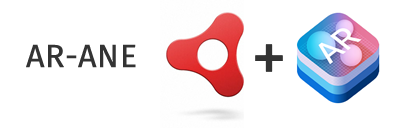

ARKit Adobe Air Native Extension for iOS 11.0+
This ANE provides bindings for the ARKit API

[ASDocs Documentation](https://tuarua.github.io/asdocs/arane/index.html)

-------------

Much time, skill and effort has gone into this. Help support the project

[](https://paypal.me/tuarua)

-------------

### The ANE + Dependencies

N.B. You must use a Mac to build an iOS app using this ANE. Windows is NOT supported.

From the command line cd into /example and run:

```shell
bash get_ios_dependencies.sh
```

This folder, ios_dependencies/device/Frameworks, must be packaged as part of your app when creating the ipa. How this is done will depend on the IDE you are using.   
After the ipa is created unzip it and confirm there is a "Frameworks" folder in the root of the .app package.

### Getting Started

Firstly, familiarise yourself with the concepts of Apple's ARKit. This ANE is at its core a binding for the ARKit APIs.

### Usage
```actionscript
arkit = ARANE.arkit;
if (!arkit.isSupported) {
    trace("ARKIT is NOT Supported on this device");
    return;
}

arkit.view3D.showsStatistics = false;
arkit.view3D.automaticallyUpdatesLighting = true;
arkit.view3D.antialiasingMode = AntialiasingMode.multisampling4X;
arkit.view3D.init();
var config:WorldTrackingConfiguration = new WorldTrackingConfiguration();
if (arkit.iosVersion >= 11.3) {
    config.planeDetection = [PlaneDetection.horizontal, PlaneDetection.vertical];
} else {
    config.planeDetection = [PlaneDetection.horizontal];
}
arkit.view3D.session.run(config, [RunOptions.resetTracking, RunOptions.removeExistingAnchors]);
```
### Geometries

The following geometries based on their SCNKit equivalents are available:
Box, Sphere, Capsule, Cone, Cylinder, Plane, Pyramid, Torus, Tube

```actionscript
var cone:Cone = new Cone(0, 0.05, 0.1);
var node:Node = new Node(cone);
arkit.view3D.scene.rootNode.addChildNode(node);
```

### Materials

Materials can be supplied as:   
ARGB uint   
BitmapData   
String path to image file

```actionscript
box.firstMaterial.diffuse.contents = ColorARGB.RED;

sphere.firstMaterial.diffuse.contents = "materials/globe.png";

//supply 6 materials for 6 sides of box
box.materials = new <Material>[redMat, greenMat, blueMat, yellowMat, brownMat, whiteMat];
```

### Physics

```actionscript
var box:Box = new Box(0.1, 0.1, 0.1);
box.firstMaterial.diffuse.contents = ColorARGB.ORANGE;
var boxNode:Node = new Node(box);
var boxShape:PhysicsShape = new PhysicsShape(box);
var physicsBody:PhysicsBody = new PhysicsBody(PhysicsBodyType.dynamic, boxShape);
physicsBody.allowsResting = true;

boxNode.physicsBody = physicsBody;
boxNode.position = new Vector3D(0, 0.5, 0);

arkit.view3D.scene.rootNode.addChildNode(boxNode);
```

### Detecting Planes

```actionscript
arkit = ARANE.arkit;
if (arkit.iosVersion >= 11.3) {
    config.planeDetection = [PlaneDetection.horizontal, PlaneDetection.vertical];
} else {
    config.planeDetection = [PlaneDetection.horizontal];
}
arkit.addEventListener(PlaneDetectedEvent.ON_PLANE_DETECTED, onPlaneDetected);

private function onPlaneDetected(event:PlaneDetectedEvent):void {
    var planeAnchor:PlaneAnchor = event.anchor;
    var node:Node = event.node;
    
    var plane:Box = new Box(planeAnchor.extent.x, planeAnchor.extent.z, 0);
    var gridTexture:String = "materials/grid.png";
    plane.firstMaterial.diffuse.contents = gridTexture;
    
    var planeNode:Node = new Node(plane);
    planeNode.position = new Vector3D(planeAnchor.center.x, 0, planeAnchor.center.z)
    var boxShape:PhysicsShape = new PhysicsShape(plane);
    planeNode.physicsBody = new PhysicsBody(PhysicsBodyType.static, boxShape);
    planeNode.eulerAngles = new Vector3D(-Math.PI / 2, 0, 0);
    node.addChildNode(planeNode);
}
```

### Camera Tracking

```actionscript
arkit = ARANE.arkit;
arkit.addEventListener(CameraTrackingEvent.ON_STATE_CHANGE, onCameraTrackingStateChange);

private function onCameraTrackingStateChange(event:CameraTrackingEvent):void {
    switch (event.state) {
        case TrackingState.notAvailable:
            break;
        case TrackingState.normal:
            break;
        case TrackingState.limited:
            switch (event.reason) {
                case TrackingStateReason.excessiveMotion:
                    break;
                case TrackingStateReason.initializing:
                    break;
                case TrackingStateReason.insufficientFeatures:
                    break;
                case TrackingStateReason.relocalizing:
                    break;
            }
            break;
    }
}
```

### Detecting Touches

```actionscript
arkit = ARANE.arkit;
arkit.addEventListener(TapEvent.ON_SCENE3D_TAP, onSceneTapped);
private function onSceneTapped(event:TapEvent):void {
    if (event.location) {
        // look for planes
        var arHitTestResult:ARHitTestResult = arkit.view3D.hitTest3D(event.location, [HitTestResultType.existingPlaneUsingExtent]);
        if (arHitTestResult) {
            // plane tapped
        }
        
        var hitTestResult:HitTestResult = arkit.view3D.hitTest(event.location, new HitTestOptions());
        trace("hitTestResult", hitTestResult);
        if (hitTestResult) {
            // node tapped on
        }
    }
}
```

### Running on Simulator

ARKit won't run on the simulator

### Running on Device

The example project can be run on the device from IntelliJ using AIR 32.

### Issues

The Issues section is for bugs and API requests **only**.     
Use the supplied template or the ticket will be closed.   
Paid Premium support is available.

### Contributing

If you have knowledge of ARKit contributions are welcome. This includes adding documentation, sample code and Scenekit models.   
Likewise, sponsorship or donations will go a long way to pushing the ANE further along.

### Prerequisites

You will need:
- a Mac. Windows is not supported
- an iOS device with an A9 or later processor
- IntelliJ IDEA / Flash Builder
- AIR 32.0.0.103 or greater
- Xcode 10.1 if you wish to edit the iOS source
- wget on OSX

### Task List

* Planes
    - [x] Horizontal Plane Detection
    - [x] Vertical Plane Detection (iOS 11.3)
    - [x] Plane Updates
    - [x] Plane Removal
    - [x] Apple Sample 'Focus Square'
* Geometry
    - [x] Box
    - [x] Capsule
    - [x] Cone
    - [x] Cylinder
    - [x] Plane
    - [x] Pyramid
    - [x] Shape (from SVG)
    - [x] Sphere
    - [x] Models
        - [x] from .scn
        - [x] from .dae
    - [ ] Text
    - [x] Torus
    - [x] Tube
* Lighting
* Materials
    - [x] Colour
    - [x] Image
    - [x] BitmapData
* Physics
    - [x] Body
    - [x] Collision Events
    - [ ] Vehicle
* Animation
* Camera
   - [x] Tracking
   - [x] Autofocus (iOS 11.3)
* Touch
    - [x] Tap
    - [x] Swipe
    - [x] Pinch
    - [x] Long Press
* Permissions
    - [x] Camera
* Hit Test
    - [x] Planes
    - [x] Nodes
* Image Detection
    - [x] AR Reference images (iOS 11.3)
* Object Detection
    - [x] AR Reference object (iOS 12.0)


### References
* [https://developer.apple.com/documentation/arkit]
* [https://github.com/eh3rrera/ARKitSceneKitExample]
* [https://github.com/rosberry/pARtfolio]
* [https://www.appcoda.com/arkit-physics-scenekit/]
